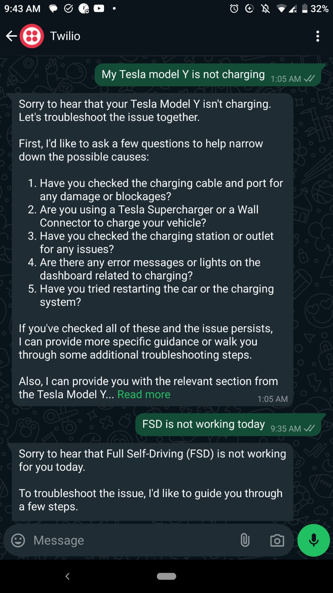

# WhatsApp Chatbot to answer questions from Tesla car manuals using LangChain, Pinecone, and Twilio

---

## Project Overview

This repository contains three core Python files, `ingest.py`, `app.py`, and  `main.py` designed to enable a **WhatsApp chatbot** that can intelligently answer questions about Tesla car manuals. The bot uses a **Retrieval-Augmented Generation (RAG)** approach to fetch information from Tesla's manuals and respond to user queries via WhatsApp.

The bot is hosted using **FastAPI**, and the setup integrates **ngrok** for local development and testing and **Twilio** for receiving and sending messages. **Pinecone** is used for vector storage of Tesla manual chunks, and **OpenAI** is used for embedding generation. Finally, **LangChain** is leveraged for retrieval and response generation from the documents.

---

## Considering the right RAG approach.

While working LLMs which have a knowledge cut-off of more than an year, it is important to consider the right RAG approach.

In order to evaluate which is the best embedding model to consider, chunking strategy, chunk size/overlap and the embedding dimension, I highly recommend using [vectorize.io](https://vectorize.io/).

This platform evaluates many embedding models and provides a comprehensive analysis of their performance. It also offers a visual representation of the data, making it easier to compare and choose the best model for your specific use case.

Check out the screenshots below.


It is a very simple platform to use and I highly recommend it to anyone who is working with LLMs and RAG before making a decision.


---

## How It Works

- **ingest.py**: Handles loading, chunking, and embedding Tesla manuals into **Pinecone**.
- **app.py**: LangChain that utilizes meta-llama/Meta-Llama-3.1-8B-Instruct-Turbo LLM for generating responses.
- **main.py**: Hosts the backend with endpoints catering to whatsapp as well as web based requests.

---

## Setup

### Prerequisites:
- Python 3.8+
- Twilio account and WhatsApp sandbox setup
- Ngrok for exposing your local server and development.
- Pinecone API key
- OpenAI API key
- TogetherAI API key.

### Installation

1. Clone the repository:
   ```bash
   git clone https://github.com/sher-somas/Tesla-owners-manual-chat-bot.git
   cd Tesla-owners-manual-chat-bot
   ```

2. Install the required dependencies:
   ```bash
   pip install -r requirements.txt
   ```

3. Configure your environment variables in a `.env` file:
   ```
   TWILIO_ACCOUNT_SID=<your_twilio_account_sid>
   TWILIO_AUTH_TOKEN=<your_twilio_auth_token>
   PINECONE_API_KEY=<your_pinecone_api_key>
   OPENAI_API_KEY=<your_openai_api_key>
   TOGETHER_API_KEY=<together_api_key>
   ```

### Ingest the Tesla Manuals

Before you can query the Tesla car manuals, you need to process and upload them to Pinecone using **ingest.py**:

1. Place all the PDF manuals in a folder named `manuals`.
2. Run the ingestion script:
   ```bash
   python ingest.py --folder_name manuals
   ```

This script will:
- Load the Tesla manuals from the specified folder.
- Split them into smaller text chunks.
- Use OpenAI's embedding model to generate vector embeddings.
- Upload the chunks along with their embeddings to Pinecone for later retrieval.

---

## File Explanations

### 1. `ingest.py` - Retrieval-Augmented Generation (RAG) Data Preparation

This file is responsible for preparing the Tesla manuals for retrieval. The key steps are:

- **PDF Loading**: The script reads Tesla car manuals from a folder of PDFs.
  
- **Chunking**: The PDFs are split into smaller, manageable chunks of text using a chunking method. These chunks make it easier to retrieve relevant information based on user queries.
  
- **Embedding**: Each chunk is passed to OpenAI's embedding model (`text-embedding-ada-002`) to generate vector representations.
  
- **Pinecone Indexing**: The generated embeddings are uploaded to a Pinecone index called `tesla-manuals`. This allows for efficient vector search, enabling the chatbot to retrieve the most relevant chunks when a user asks a question.

### 2. `app.py` - Hosting the API and Twilio Integration

This file parses the incoming WhatsApp messages via Twilio and responds to them using the RAG approach.

- **RAG Pipeline**: The RAG pipeline in `app.py` works as follows:
  1. A user asks a question on WhatsApp.
  2. The Pinecone index is queried using the user's question to find relevant chunks from the Tesla manuals.
  3. The retrieved chunks are combined with the question and passed to a language model (`meta-llama/Meta-Llama-3.1-8B-Instruct-Turbo`) that generates a human-readable answer.
  4. The answer is returned to the user via Twilio's messaging API.

- **Twilio Integration**: The FastAPI app defines an endpoint (`/question`) for web based requests and (`/question/whatsapp`) for whatsapp requests that Twilio will hit whenever a new WhatsApp message is received. The user's query is processed, the chatbot generates a response, and the response is sent back to the user on WhatsApp.

---

## Running the API with Ngrok and Twilio

1. Start the Flask server locally:
   ```bash
   uvircorn main:app --reload
   ```

2. Expose the server using ngrok for testing locally:
   ```bash
   ngrok http 5000
   ```

   This will generate a public URL (e.g., `http://your-ngrok-url.ngrok.io`) that you can use for Twilio.

3. Configure your Twilio WhatsApp sandbox:
   - Go to your Twilio Console and under WhatsApp Sandbox, configure the **Webhook URL** to point to the ngrok URL:
     ```
     http://your-ngrok-url.ngrok.io/answer
     ```

4. Now, you can send messages to your Twilio WhatsApp number, and the chatbot will respond with relevant information from the Tesla manuals!

---

## Example Interaction

**User**: What is Ludicrous Mode?  
**Bot**: Ludicrous Mode is a feature in Tesla cars that allows for faster acceleration by increasing the output of the electric motors.

---

## Screenshots from Whatsapp





---


## Conclusion

This project demonstrates how to implement RAG based approach using Pinecone, LangChain, Twilio, and OpenAI to build an intelligent WhatsApp chatbot. The chatbot can retrieve and respond to questions about Tesla manuals, offering a useful and friendly interface for users to interact with Tesla's documentation.
